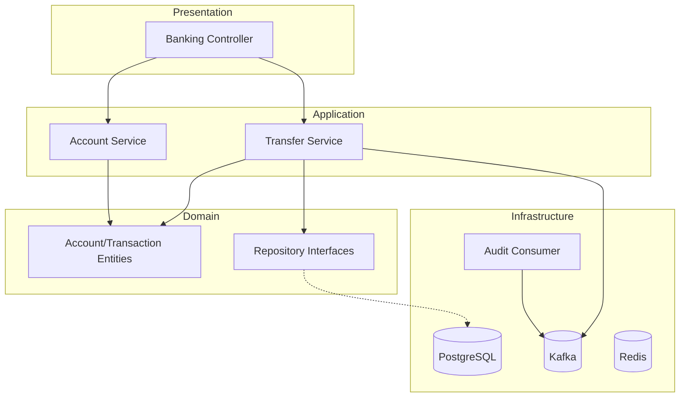

# 🏦 Digital Banking System (Clean Architecture)


A high-performance, scalable, and robust digital banking backend built with **Spring Boot 3** and **Clean Architecture**. This system handles ACID-compliant fund transfers, high-concurrency balance updates, and provides a full audit trail via Event Sourcing.

---

## 🏗️ Technical Architecture

This project follows **Clean Architecture** principles, ensuring that the business logic is independent of frameworks, UI, and external databases.

### Layer Breakdown
- **Domain Layer**: Essential business logic (`Account`, `Transaction`) and repository interfaces. Contains zero dependencies on external frameworks.
- **Application Layer**: Use cases like `TransferService`. Orchestrates the flow of data between the domain and infrastructure.
- **Infrastructure Layer**: Implementation details such as PostgreSQL (JPA), Kafka Producers/Consumers, and Redis configuration.
- **Web Layer**: RESTful API endpoints, request validation, and global exception handling.

### 📊 Architecture Flow


---

## � Core Features

### 1. ACID Transactions & Concurrency
The system guarantees **Atomicity, Consistency, Isolation, and Durability** for all fund transfers. To handle high concurrency, we implement **Optimistic Locking** using JPA `@Version`. This prevents race conditions during simultaneous balance updates without the performance bottleneck of pessimistic locks.

### 2. Event Sourcing & Audit Trail
Every significant state change (like a transfer) triggers a domain event published to **Kafka**.
- **Audit Logging**: A dedicated `AuditService` consumes these events to maintain an immutable log.
- **Scalability**: Decoupling the audit trail from the core transaction ensures the system remains responsive.

### 3. Professional Error Handling
A `GlobalExceptionHandler` ensures that the API always returns structured, meaningful error messages and appropriate HTTP status codes (e.g., `InsufficientFundsException` -> `400 Bad Request`).

---

## �🚀 Getting Started

### Prerequisites
- **Docker & Docker Compose**
- **Java 21 (JDK)**
- **Maven 3.9+**

### 🛠️ Step-by-Step Setup

1. **Spin up Infrastructure**:
   ```bash
   make docker-up
   ```
   This starts PostgreSQL, Redis, and Kafka in the background.

2. **Run Tests**:
   ```bash
   make test
   ```
   Uses **Testcontainers** to verify the system against real infrastructure.

3. **Launch Application**:
   ```bash
   make run
   ```

---

## 📋 API Documentation

### Accounts
- **POST `/api/accounts`**: Create a new account.
  ```json
  {
    "holderName": "John Doe",
    "initialBalance": 1500.00
  }
  ```
- **GET `/api/accounts/{id}`**: Retrieve account details and current balance.

### Transfers
- **POST `/api/transfers`**: Execute a transfer between two accounts.
  ```json
  {
    "sourceId": "uuid-1",
    "destinationId": "uuid-2",
    "amount": 100.00
  }
  ```

---

## 📊 Benchmarking & Performance

The system is designed for high throughput. You can verify performance using the included integration tests which simulate concurrent transfers.

**Target Metrics:**
- **Consistency**: 100% of concurrent transfers resolved without balance corruption.
- **Latency**: Sub-50ms for core transfer operations (ignoring async Kafka latency).

To run a manual stress test with `wrk`:
```bash
wrk -t12 -c400 -d30s -s scripts/transfer.lua http://localhost:8080/api/transfers
```

---

## 🗺️ Roadmap & Open Issues

### Open Issues
- [ ] Redis lock timeout tuning for extremely high latency environments.
- [ ] Multi-currency support (Domain layer currently uses single currency `BigDecimal`).

### Next Steps
- [ ] **Saga Pattern**: Implement for distributed transactions across multiple microservices.
- [ ] **Two-Factor Auth**: Add security layer for high-amount transfers.
- [ ] **Spring Security**: Integrate JWT-based authentication.

---

## 🤝 Project Structure
```text
src/
├── main/java/com/bank/digital/
│   ├── application/     # Use Cases
│   ├── domain/          # Entities & Interfaces
│   ├── infrastructure/  # DB, Kafka, Redis
│   └── web/             # Controllers & API
└── test/                # Testcontainers & Unit Tests
```

